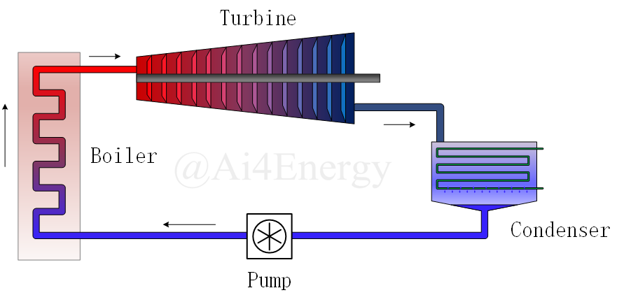

# Ai4ESimulator

## 简介

高可拓展的云架构流程系统仿真平台Ai4ESimulator基于新一代开源科学计算编程语言Julia与Vue3前端框架，适用于复杂流程系统的云仿真平台。云仿真平台采用前后端分离技术:前端为Web界面;后端为集解析器、组件库、求解器三大模块为一体的仿引擎，各模块间通过接口协同工作。仿真平台具备高度可拓展性，后端参析器可嵌入参数辨识问题、优化问题、控制问题等多种问题的代码生成工具;组件库广泛适用于能源、化工、机器、电气等多个领域的流程系统模型。

## 案例

### 1.电解槽

使用光伏电池驱动电解槽是一种利用太阳能直接驱动电解过程的技术。通过将光伏电池与电解槽相连接，可以将太阳能光能转化为电能，并利用该电能进行电解反应。

#### 操作演示


#### 部分代码

```julia
using ModelingToolkit, DifferentialEquations
using Ai4EComponentLib
using Ai4EComponentLib.Electrochemistry

@named Pv = PhotovoltaicCell()
@named El = PEMElectrolyzer()
@named ground = Ground()
eqs = [
    connect(Pv.p, El.p)
    connect(Pv.n, El.n, ground.g)
]
@named OdeFun = ODESystem(eqs, t)
@named model = compose(OdeFun, [Pv, El, ground])
sys = structural_simplify(model)
u0 = [
    El.m_H_2 => 0.0
    El.∂_m_H_2 => 0.0
]
prob = ODEProblem(sys, u0, (0.0, 30.0))
sol = solve(prob)
```


### 2.锂电池

为了将光伏电池生成的直流电能存储起来，需要使用储能系统，而锂电池是一种常用的选择。光伏电池阵列中的直流电能经过电流调节和逆变等电子设备的处理后，可输入到锂电池系统中进行充电。锂电池的特点是能量密度高、寿命长、充放电效率高等，因此被广泛应用于储能领域。当太阳能充足时，光伏电池会将多余的能量存储到锂电池中，以备晚上或阴天时使用。这种方式实现了可再生能源的利用和能源的平衡，有助于减少对传统能源的依赖，降低碳排放并提高能源的可持续性。

#### 操作实例


#### 部分代码

```julia
using ModelingToolkit, DifferentialEquations
using Ai4EComponentLib
using Ai4EComponentLib.Electrochemistry
using Plots

@named batter = Lithium_ion_batteries()
@named Pv = PhotovoltaicCell()
@named ground = Ground()

eqs = [
    connect(batter.p, Pv.p)
    connect(batter.n, Pv.n, ground.g)
]

@named OdeFun = ODESystem(eqs, t)
@named model = compose(OdeFun, [Pv, batter, ground])
sys = structural_simplify(model)
u0 = [
    batter.v_f => 0.5
    batter.v_s => 0.5
    batter.v_soc => 0.5
]
prob = ODEProblem(sys, u0, (0.0, 3600.0))
sol = solve(prob)
```


### 3.空气管道系统

#### 系统模式图


#### 操作实例：


#### 部分代码

```julia
# Define components
using Ai4EComponentLib
using Ai4EComponentLib.AirPipeSim
using ModelingToolkit, DifferentialEquations

@named inlet = PressureSource(p=6e5, T=300)
@named pipe1 = AirSimplePipe(R=100, T=300)
@named pipe2 = TransitionPipe(n=20, f=0.016, D=0.2, L=100, T=300, pins=5.6e5, pouts=4e5)
@named airTank = AirStorageTank(V=20, T=300, p0=4e5)
@named pipe3 = TransitionPipe(n=20, f=0.016, D=0.2, L=100, T=300, pins=4e5, pouts=2e5)
@named outlet = FlowSource(qm=-3.0, T=300)

# Connect components
eqs=[
    connect(inlet.port,pipe1.inlet)
    connect(pipe1.outlet,pipe2.inlet)
    connect(pipe2.outlet,airTank.inlet)
    connect(airTank.outlet,pipe3.inlet)
    connect(pipe3.outlet,outlet.port)
]

@named connects=ODESystem(eqs,t)
@named model=compose(connects,inlet,pipe1,pipe2,pipe3,airTank,outlet)

# Simplify the system and solve
sys=structural_simplify(model)

prob=ODAEProblem(sys,[],(0.0,5.0))

sol=solve(prob,Rosenbrock23())
```


### 4.水利管网系统

#### 系统模型图


#### 操作实例


#### 部分代码

```julia
@info "Running IncompressiblePipe..."
using Ai4EComponentLib
using Ai4EComponentLib.IncompressiblePipe
using OrdinaryDiffEq, ModelingToolkit
using Test

@info "Constructing components..."
@named high = Source_P(D=0.15, z=25.0, ρ=1.0E3, p=101325, K_inlet=0.5)
@named low = Sink_P(p=101325)
@named elbow1 = ElbowPipe(K=0.9, D=0.15, ρ=1.0E3, zin=0.0, zout=0.0)
@named elbow2 = ElbowPipe(K=0.9, D=0.15, ρ=1.0E3, zin=15.0, zout=15.0)
@named pipe1 = SimplePipe(L=30.0, D=0.15, f=0.023, zin=25.0, zout=0.0, K_inside=0.0)
@named pipe2 = SimplePipe(L=15.0, D=0.15, f=0.023, zin=0.0, zout=15.0, K_inside=0.0)
@named pipe3 = SimplePipe(L=60.0, D=0.15, f=0.023, zin=15.0, zout=15.0, K_inside=10.8)

@info "Constructing system..."
eqs = [
    connect(high.port, pipe1.in)
    connect(pipe1.out, elbow1.in)
    connect(elbow1.out, pipe2.in)
    connect(pipe2.out, elbow2.in)
    connect(elbow2.out, pipe3.in)
    connect(pipe3.out, low.port)
]

@named model = compose(ODESystem(eqs, t, name=:funs), [high, low, pipe1, pipe2, pipe3, elbow1, elbow2])

@info "Simplifying system..."
sys = structural_simplify(model)

@info "Solving system..."
prob = ODEProblem(sys, [], (0, 0))
sol = solve(prob, Rosenbrock23())

@test isapprox(sol[pipe1.in.q][1], 0.045, atol=0.0005)
```


### 5.热力循环系统

整个朗肯循环由热能输入、膨胀、冷凝和压缩等过程组成。通过这些过程，热能源被转化为机械能输出。朗肯循环具有稳定的动力输出和较高的能量效率，其中一部分能量通过冷凝器中的热回收得以回收利用，从而提高了系统的能量效率。

#### 系统模式图



#### 操作实例


#### 部分代码

```julia
@info "Running ThermodynamicCycle..."
using Ai4EComponentLib
using Ai4EComponentLib.ThermodynamicCycle
using OrdinaryDiffEq, ModelingToolkit
using Test

@info "Constructing components..."
@named pump = IsentropicProcess(inter_state="P")
@named pump_P = ThermalStates(state="P", value=3.0E6)

@named boiler = IsobaricProcess(inter_state="T")
@named boiler_T = ThermalStates(state="T", value=723.15)

@named turbine = IsentropicProcess(inter_state="P")
@named turbine_P = ThermalStates(state="P", value=4.0E3)

@named condenser = IsothermalProcess(inter_state="Q_0")

@info "Constructing system..."
eqs = [
    connect(pump.out, boiler.in)
    connect(boiler.in, pump_P.node)
    connect(boiler.out, turbine.in)
    connect(turbine.in, boiler_T.node)
    connect(turbine.out, condenser.in)
    connect(condenser.in, turbine_P.node)
    connect(condenser.out, pump.in)
]

@named model = ODESystem(eqs, t, systems=[pump, boiler, turbine, condenser, pump_P, boiler_T, turbine_P])

@info "Simplifying system..."
sys = structural_simplify(model)

@info "Solving system..."
prob = ODEProblem(sys, [], (0, 0))
sol = solve(prob, Rosenbrock23())

q1 = sol[boiler.Δh][1]
w = -sol[turbine.Δh][1] - sol[pump.Δh][1]

@test isapprox(w / q1, 0.4, atol=0.05)
```