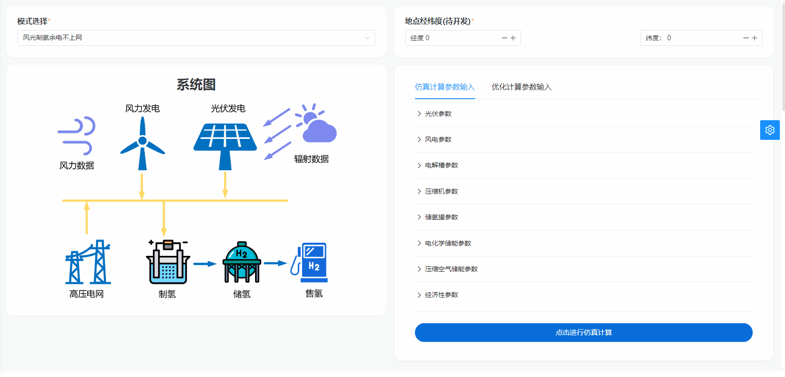
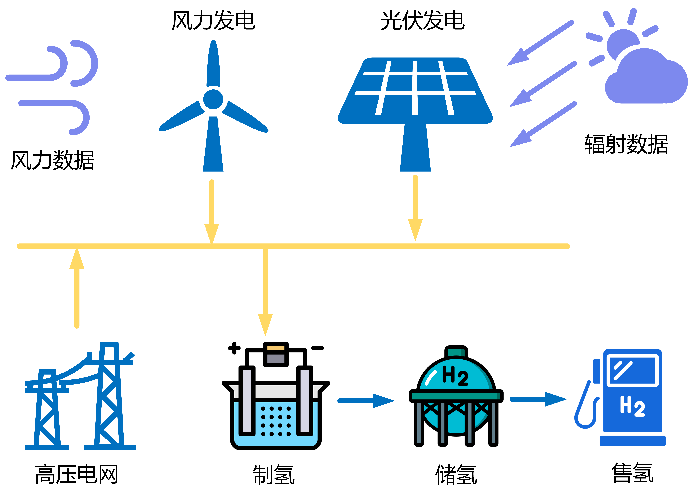
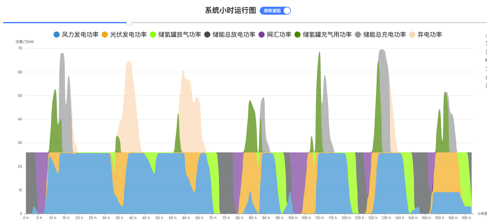
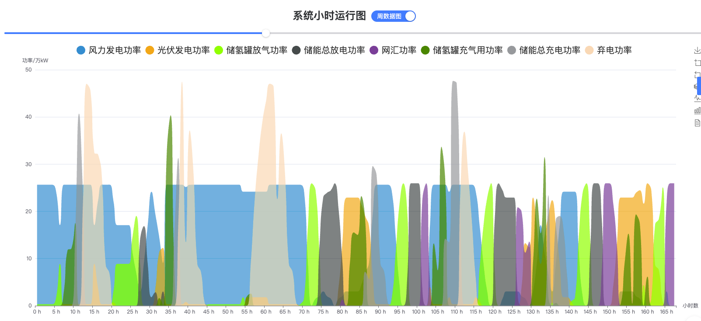
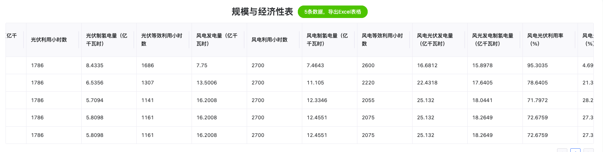

# 风光制氢

## 简介

风光制氢场景针对制氢需求量，考虑风光制氢余电不上网场景的技术经济性，重点研究储氢和储能模块对综合含税售氢价格的影响，主要包含三大模块：

（1）基于给定场景的系统组件拓扑结构，输入相应的算例参数，实现对应场景8760小时仿真计算的仿真模块；

（2）采用元启发式优化方法获得相应场景下最佳容量配置的优化模块；

（3）计算对应场景在行业基准参数下的经济性评价模块；

## 操作演示



## 风光制氢模式图

 

 


## 优化结果输出

### 系统小时运行图（堆叠）——周数据:



### 系统小时运行图（平铺）——周数据



### 规模与经济性表



## 部分代码

```julia
function optimize_ies_ele!(machines::Tuple, isOpt::Vector, fin::Financial, ::Val{1})
    pv, wt, ec, hc, _ = machines
    isOpt = isOpt[1:4]
    obj = function (x)
        # 顺序为光伏、风机、电解槽、储氢，顺序不能错！！！
        machines = matchOptVars((pv, wt, ec, hc), isOpt, x)
        wt_power, pv_power, load_power, hc_power = map(outputEnergy, machines)
        powers = (wt_power, pv_power, load_power, hc_power)
        # 供给-需求=ΔE
        ΔE = wt_power + pv_power - load_power - hc_power
        # 余电上网，网汇购电
        ΔE_to_grid, ΔE_from_grid = pn_split(ΔE)
        # 返回 "制氢价格（元/kg）"，该数值即为待优化的目标值
        dictData = economicAnalysisData(machines, fin, powers,
            (sum(ΔE_to_grid), sum(ΔE_from_grid), 0), Val(1))
        objective = -abs(1 / dictData["静态总投资回收年限（年）"])
        return objective
    end
    # 调用优化求解器，可查BlackBoxOptim.jl文档
    res = bboptimize(obj; SearchRange=(1e1, 1e7),
        NumDimensions=sum(isOpt), TraceMode=:verbose)
    # 输出优化结果
    candidate, fitness = best_candidate(res), best_fitness(res)
    println("优化变量结果： $candidate", "目标值： $fitness")
    machines = matchOptVars((pv, wt, ec, hc), isOpt, candidate)
    # 返回最优解的仿真结果
    return simulate_ies_ele!((machines..., 0), fin, Val(1))
end

"""

光伏组件

组件参数:
- `input_GI`: 光照强度输入， Wh/m2
- `input_Ta`: 环境温度输入， ℃
- `input_v`: 风速输入， m/s
- `capacity`: 总装机容量， kW
- `unit_capacity`: 单机容量， kW
- `machine_number`: 机组数量
- `Δt`: 采样时间， h
- `A`: 光伏板面积， m2
- `f_PV`: 光伏板填充因子
- `η_PV_ref`: 光伏板额定转换效率
- `λ`: 光伏板温度系数
- `Tc_ref`: 光伏板额定温度， ℃
- `tau_alpha`: 光伏板吸收率
- `η_inverter`: 综合效率，如考虑逆变器、电机效率等
- `life_year`: 使用年限，年
- `cost_initial`: 初始成本，元/kW
- `cost_OM`: 年运维成本，元/kW
- `cost_replace`: 更换成本，元/kW
- `staff_number`: 人员数

"""
Base.@kwdef mutable struct PhotovoltaicCell <: RenewableEnergyMachine
    input_GI::Vector = Float64[]
    input_Ta::Vector = Float64[]
    input_v::Vector = Float64[]
    capacity::Float64 = 1e7
    unit_capacity::Float64 = 1.0
    machine_number::Int64 = 1
    Δt::Float64 = 1.0
    A::Float64 = 3.1
    f_PV::Float64 = 1 
    η_PV_ref::Float64 = 20.9 / 100
    λ::Float64 = -0.34 / 100
    Tc_ref::Float64 = 25.0
    tau_alpha::Float64 = 0.9
    η_inverter::Float64 = 0.98
    life_year::Float64 = 20.0
    cost_initial::Float64 = 3800.0
    cost_OM::Float64 = 190.0
    cost_replace::Float64 = 3800.0
    staff_number::Int64 = 50
end
```

