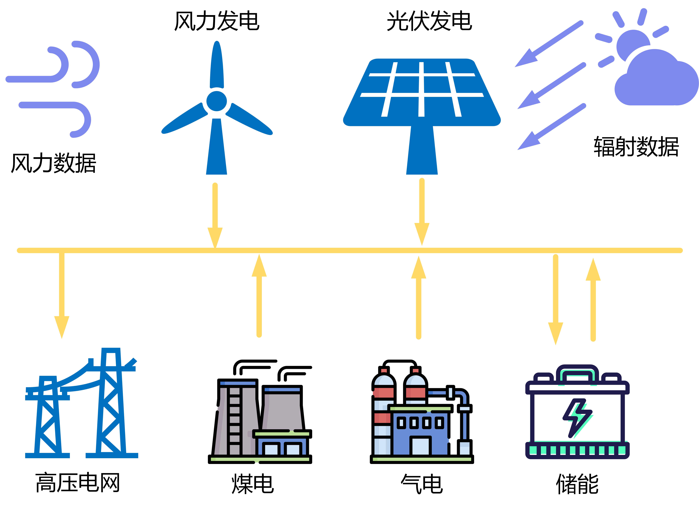
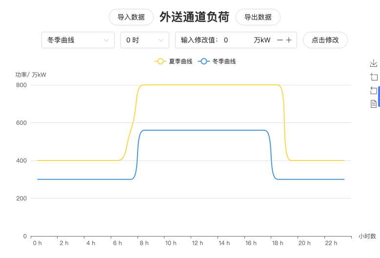
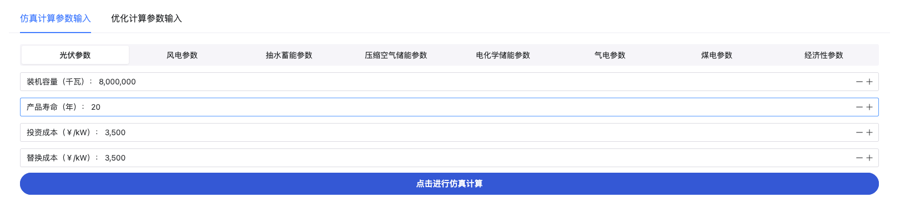
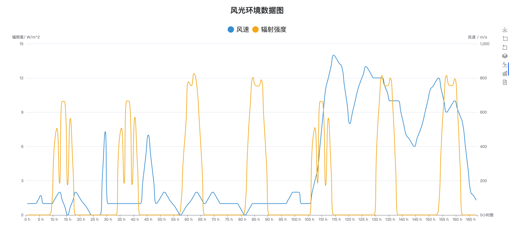
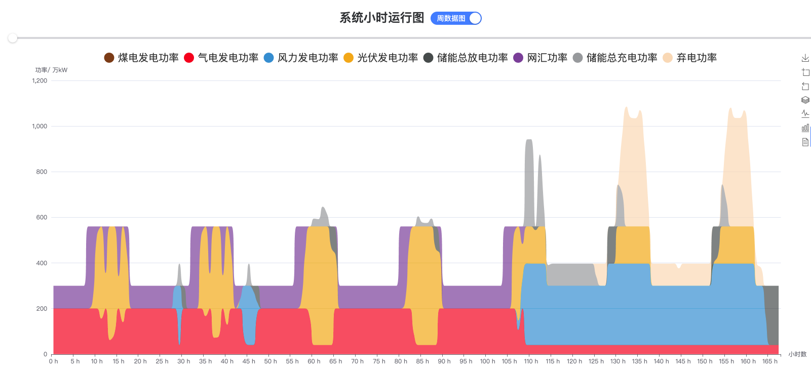
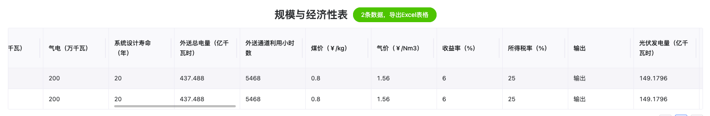

# 风光煤气储发电

## 简介

该功能针对风光气煤储外送通道场景，考虑风光气煤储典型场景的技术经济性，论证气电和煤电两种典型化石能源支撑新能源大基地的技术经济特征，重点研究两者调峰灵活性与经济性。模型中主要包含三大模块：

（1）基于给定场景的系统组件拓扑结构，输入相应的算例参数，实现对应场景8760小时仿真计算的仿真模块；

（2）采用元启发式优化方法获得相应场景下最佳容量配置的优化模块；

（3）计算对应场景在行业基准参数下的经济性评价模块；

## 操作演示


## 操作运行方法及效果

### 1.模式选择
如下图所示，导航栏中选择风光制氢或者风光煤气储模式。


### 2.系统图展示
展示对应场景下系统图




### 3.外送通道负荷
外送通道负荷界面如图所示。外送通道负荷可实现数据的修改、导入和导出。




### 4.参数输入与计算
参数输入包含仿真计算参数输入与优化计算参数输入，如图3-25所示。仿真计算参数输入包含每种组件参数输入，滑动点击相应项即可切换对应组件（风电、光电、抽水蓄能、压缩空气储能、电化学储能、气电、煤电、经济性参数）的参数输入菜单。每种组件含有默认值，若不输入则直接采用默认值优化计算参数输入在仿真计算参数输入基础之上额外包含选择待优化容量参数下拉选择框。通过该选择框可选择需要优化的变量。优化计算参数输入与仿真计算参数输入中的组件参数修改界面相互关联，在任意一个界面中修改都可行。参数输入完成后点击按钮点击进行仿真/优化计算即可完成计算。



### 5.环境数据输出图
如图所示，展示了与堆叠图对应时间的环境数据图，可直观看出辐照强度与风速的大小。该图采用双Y轴图，左轴表示辐照强度，右轴表示风速。




### 6.小时运行图
如图所示，小时运行图包含周运行图与日运行图，可点击按钮进行切换。图例中包含各类电源的功率、网汇电量与弃电功率；8760小时分割为365天，一张图展示24小时数据，通过滑动条拖动切换日期；点击图例可选择是否显示该数据；右侧工具箱可实现图片下载、放大、缩小、切换为柱状图、切换为普通图、数据转化等；鼠标悬浮在数据点即可显示相关数据。




### 7.规模与经济性表
如图所示，表为横向表，可保留历史计算功能。每进行一次计算，规模与经济性数据向下新增。绘图历史数据不保留，绿色导出按钮可显示数据总量，点击导出Excel表格；每页最多保留10条记录，右下方可进行翻页。




## 部分代码

```julia
function simulate_ies_ele!(machines::Tuple, fin::Financial, ::Val{1})
    pv, wt, ec, hc, _ = machines
    pv_power, wt_power, load_power = map(outputEnergy, (pv, wt, ec))
    # println(load_power)
    hc.load = outputH2Mass(load_power, ec, 1.0)
    hc_power = outputEnergy(hc)
    powers = (pv_power, wt_power, load_power, hc_power)
    # 供给-需求=ΔE
    ΔE = wt_power + pv_power - load_power - hc_power
    # 余电上网，网汇购电
    ΔE_to_grid, ΔE_from_grid = pn_split(ΔE)
    machines = (pv, wt, ec, hc)
    fd = figureDictData(wt_power, pv_power, load_power, hc_power,
        ΔE_to_grid, ΔE_from_grid, Val(1))
    ecd = economicAnalysisData(machines, fin, powers,
        (sum(ΔE_to_grid), sum(ΔE_from_grid), 0), Val(1))
    return fd, ecd
end

"""
风力发电机

组件参数:
- `input_v`: 环境风速输入
- `capacity`: 总装机容量， kW
- `unit_capacity`: 单机容量， kW
- `machine_number`: 机组数量
- `Δt`: 采样时间， h
- `η_t`: 风轮传动效率
- `η_g`: 发电机效率
- `h1`: 风速切入速度， m/s
- `h2`: 风速切出速度， m/s
- `α`: 风速指数
- `η_inverter`: 综合效率，如考虑逆变器、电机效率等
- `life_year`: 使用年限，年
- `cost_initial`: 初始成本，元/kW
- `cost_OM`: 年运维成本，元/kW
- `cost_replace`: 更换成本，元/kW
- `k `: 风速-功率曲线
- `staff_number`: 人员数

"""
Base.@kwdef mutable struct WindTurbine <: RenewableEnergyMachine
    input_v::Vector = Float64[]
    capacity::Float64 = 4e6
    unit_capacity::Float64 = 1.0
    machine_number::Int64 = 1
    Δt::Float64 = 1.0
    η_t::Float64 = 0.96
    η_g::Float64 = 0.93
    h1::Float64 = 10.0
    h2::Float64 = 135.0
    α::Float64 = 1.0 / 7.0
    η_inverter::Float64 = 1.0
    life_year::Float64 = 20.0
    cost_initial::Float64 = 4800.0
    cost_OM::Float64 = 720.0
    cost_replace::Float64 = 4800.0
    k::Function = k
    staff_number::Int64 = 50
end

k(v2) = ifelse(v2 < 3.0, 0.0,
    ifelse(3.0 <= v2 < 9.5, (-30.639 * v2^3 + 623.5 * v2^2 - 3130.4 * v2 + 4928) / 5000,
        ifelse(9.5 <= v2 < 19.5, 1.0,
            ifelse(19.5 <= v2 <= 25.0, (-203.97 * v2 + 9050.9) / 5000, 0.0))))
```

