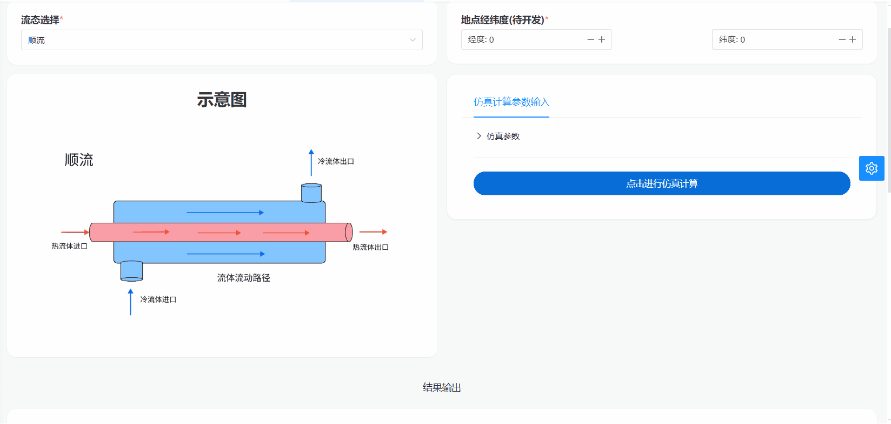
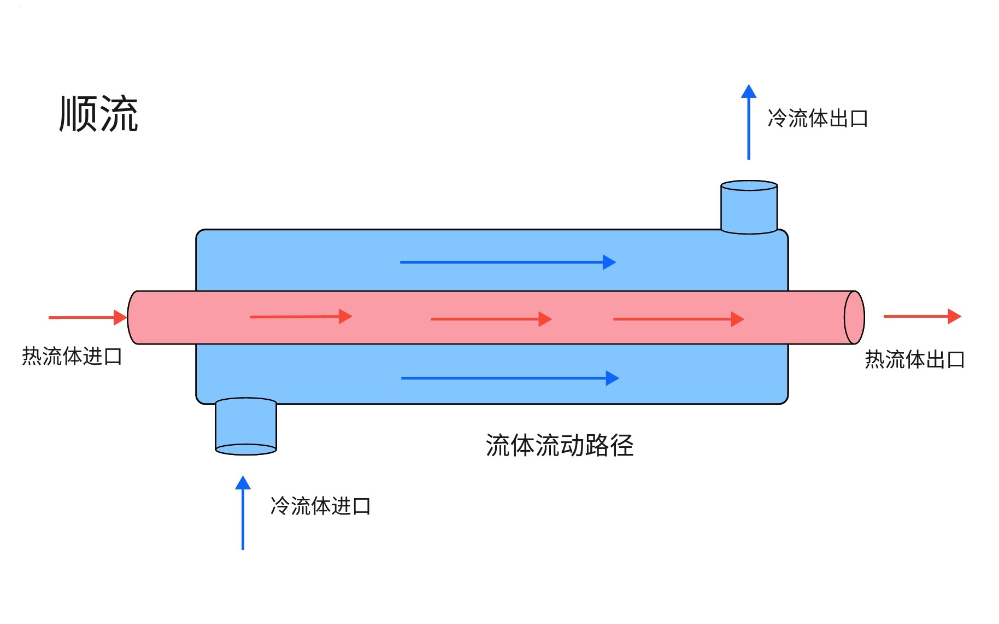
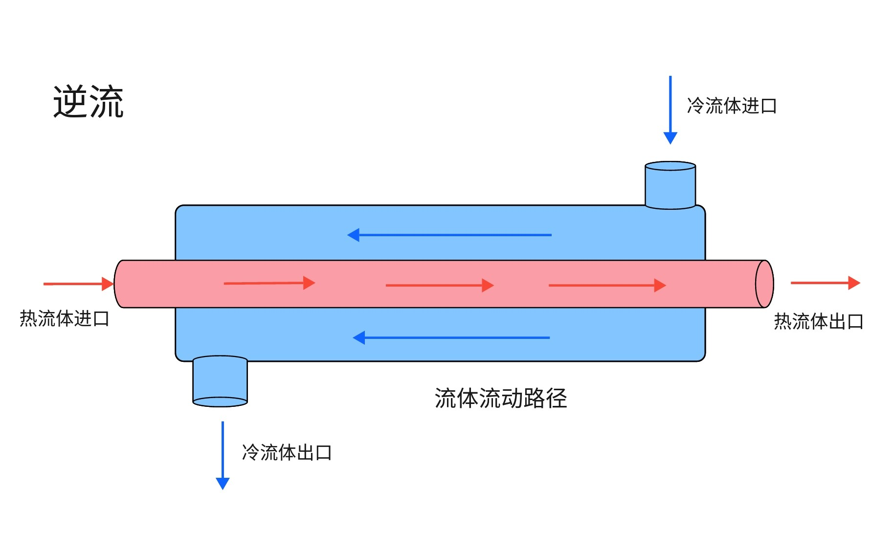
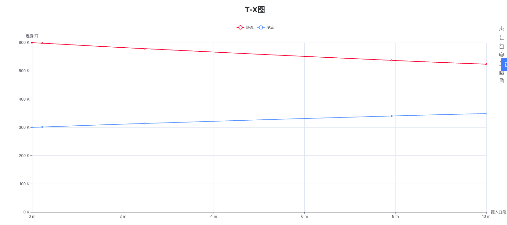

# 顺流与逆流式换热器仿真

## 简介
该部分支持套管式换热器在顺流与逆流两种流态下的仿真。通过用户输入换热器的长度、介质种类、冷热流入口温度、流量等参数，计算出冷热流体不同位置的温度值以及整体换热效率等信息，用户能更直观地了解到换热器的换热情况，并调整真实模型的相关参数，从而提高换热器效率。此仿真过程将换热原理与ODE结合，使模型更精准。

## 操作演示


## 顺流逆流换热器系统模型图
  




用户在仿真软件中选择换热器模块，并进入设置界面，从下拉菜单中选择热流体的类型（液态水、空气）并输入相关参数（冷热流体流量、换热管长度等），最后点击软件界面上的开始按钮，启动套管式换热器的仿真过程。


##  仿真结果图




## 仿真参数输出


软件将计算并生成热流与冷流的温度随距入口大小变化的T-X图以及包含换热效率、热流雷诺数等参数的结果输出表。用户可以通过这些结果图来评估换热器的性能和工作状态。

## 部分代码
```julia
function heat_exchanger!(du,u,p,t)
		#比热容
		Cp_h = CoolProp.PropsSI("C", "T", u[1], "P", p[3],p[4])
		Cp_c = CoolProp.PropsSI("C", "T", u[2], "P", p[3],p[9])
		#计算动态粘度
		μ_h = CoolProp.PropsSI("V", "T", u[1], "P", p[3], p[4])
		μ_c = CoolProp.PropsSI("V", "T", u[2], "P", p[3], p[9])

		#计算普朗特数
		Pr_h = CoolProp.PropsSI("Prandtl", "T", u[1], "P", p[3], p[4])
		Pr_c = CoolProp.PropsSI("Prandtl", "T", u[2], "P", p[3], p[9])

		#计算雷诺数
		Re_h = 4*p[1]/p[6]/μ_h/π
		Re_c = 4*p[2]/p[7]/μ_c/π

		#计算努塞尔数
		if Re_c > 10000
			Nu_c = 0.023*(Re_c^0.8)*(Pr_c^0.4)
		else
			Nu_c = 4.36
		end
		if Re_h > 10000
			Nu_h = 0.023*(Re_h^0.8)*(Pr_h^0.3)
		else
			Nu_h = 4.36
		end

		#计算传热系数
		k_h = CoolProp.PropsSI("L", "T", u[1], "P", p[3], p[4])
		k_c = CoolProp.PropsSI("L", "T", u[2], "P", p[3], p[9])

		η_h = Nu_h*k_h/p[6]
		η_c = Nu_c*k_c/p[7]
		#计算传热系数U
		U = (1/η_h+1/η_c)^(-1)
		#计算热传导方程 [1]为热流 [2]为冷流
		du[1] = U*π*p[6]*(u[2]-u[1])/(Cp_h*p[1])
		if Flow_type == "parallel"
			du[2] = U*π*p[7]*(u[1]-u[2])/(Cp_c*p[2])
		elseif Flow_type == "countercurrent"
			du[2] = -U*π*p[7]*(u[1]-u[2])/(Cp_c*p[2])
		end
	end
```